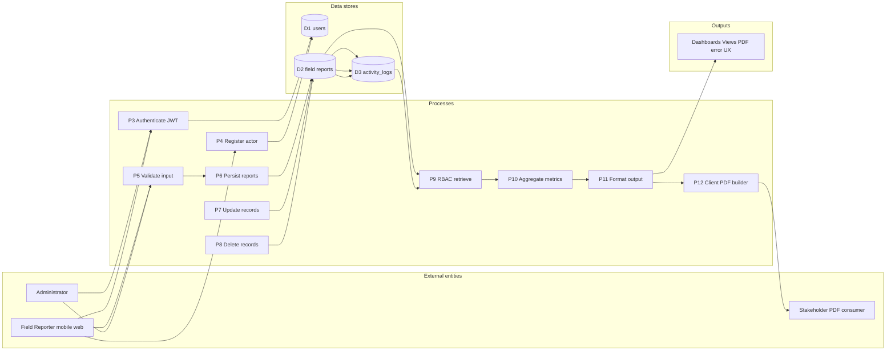

# DFD Level 1 — DFD Field Report System (This Project)

This document is **the counterpart to the printed coursework DFD**, but redrawn for the **mobile web Field Report** stack in [`dfd-mobile-web`](../README.md): JWT auth, field reports (`records`), audit trail (`activity_logs`), dashboard JSON, and client-side PDF export.

**Reference poster (grading system)** you provided: [`educational-dfd-level1-reference.png`](educational-dfd-level1-reference.png)  
**This project poster (print / Save-as-PDF):** [`dfd-level1-field-report-poster.html`](dfd-level1-field-report-poster.html)

---

## 1. External entities (actors)

| Entity | Responsibility in **this** system |
|--------|--------------------------------|
| **Administrator** | Signs in as `ROLE_ADMIN`; views **all** field reports + **global** audit stream; deletes/updates records per API rules (RBAC parity with mobile gate in larger apps — here enforced in API/query scope). |
| **Field Reporter (mobile web)** | Primary mobile actor: registers/signs-in, submits/updates/deletes **own** field reports (touch UI), refreshes dashboards, downloads PDF export from browser. Maps to authenticated `ROLE_USER`. |
| **Stakeholder consumer** | Off-system consumer of packaged output (printed PDF/email share). Represents the downstream reader of **`Export PDF`** from the Results screen—not a persisted login, purely an output sink like “report reader” on the coursework diagram edge. |

---

## 2. Processes (numbered P3+ to mirror coursework style)

| ID | Process | DFD tier |
|----|---------|----------|
| P3 | **Authenticate Actor** — email/password OAuth exchange → JWT issuance (`POST /api/auth/login`). | Boundary / validation |
| P4 | **Register Actor** — server-side credential + profile validation; persist user (`POST /api/auth/register`). | Process 1 |
| P5 | **Validate Field Report Input** — form + `express-validator` rules; sanitise strings (`POST /api/data/records`). | Process 1 |
| P6 | **Persist Field Report** — insert row + cascade audit entry (`RECORD_CREATE`). | Process 1 → store |
| P7 | **Update Field Report** — owner/admin edit with validation (`PATCH /api/data/records/:id`). | Process 1 |
| P8 | **Delete Field Report** — owner/admin delete + audit (`DELETE`). | Process 1 |
| P9 | **Role-Based Record Retrieval** — SQL filters `(admin ⇒ all)` else `user ⇒ own)` (`GET /api/data/records`). | Process 2 |
| P10 | **Aggregate Dashboard Metrics** — compute counts/priority queues (`GET /api/output/dashboard`). | Process 2–3 bridge |
| P11 | **Format Structured Output Payload** — cards + ranked table ordering for Results page. | Process 3 |
| P12 | **Render Offline Report** — `jsPDF + autotable` build on device; optional download route for documentation PDFs (`/docs/*.pdf`). | Output generator |

Supporting automatic subprocess **P8a / embedded** — whenever P5–P8 succeed, **`Write Activity Log`** records `RECORD_*` tuples (implemented inside `models/Record.js`).

---

## 3. Data stores

| Store | Contents | Tables / artefacts |
|-------|----------|-------------------|
| **D1** | User directory + credential hashes + role flag | `users` |
| **D2** | Field report corpus (title/category/description/priority/status) | `records` |
| **D3** | Immutable-style audit/event stream | `activity_logs` |

All three include `created_at` / `updated_at` (audit-friendly).

---

## 4. Representative data flows

| Source | Flow label | Sink |
|--------|------------|------|
| Field Reporter | `Enter credentials`, `JWT request` | P3 |
| Field Reporter | `Registration payload` | P4 → D1 |
| Field Reporter | `Field report form JSON` | P5 → D2 (+D3 audit) |
| Field Reporter | `PATCH body` | P7 → D2 (+D3) |
| Field Reporter | `DELETE instruction` | P8 → D2 (+D3) |
| Administrator | same auth + CRUD with elevated scope | P3,P5–P11 |
| D1 | `JOIN owner metadata` | P9,P10 |
| D2/D3 | `History + detail retrieval` | P9 → P11 |
| P11 | `Dashboard JSON` | Mobile UI canvases |
| P12 | `Binary PDF artifact` | Stakeholder consumer |

---

## 5. Outputs (display / report channels)

| Output | Produced via | Consumer |
|--------|---------------|----------|
| View Signed-In Actor | P3+P4 hydrate profile | Reporter / Administrator |
| View Scoped Field Report Inventory | P9+P11 (`Home`, `Results`) | Reporter (own) / Admin (all) |
| View Recent Audit Trail Snippet | `GET /api/data/logs` + UI list | Reporter (own) / Admin (all) |
| View KPI Cards & Sorted Table | P10 dashboard payload | Both actors |
| Download **Field Report Portfolio PDF** | P12 (`OutputView.jsx`) | Stakeholder / Reporter |
| Error / Validation Message Stream | Validation layers P3–P8 | Reporter / Administrator |

---

## 6. Mermaid overview (diagrammatic)

---

## Relationship to coursework reference diagram

| Reference (grading) trait | Mapped to this Field Report implementation |
|--------------------------|------------------------------------------------|
| 3-sided actor panel | Administrator / Reporter / stakeholder output reader |
| Long process numbering | Streams P3–P12 analogous to coursework P-bubbles |
| 16 data tables | Reduced to pragmatic trio `users`, `records`, `activity_logs` fulfilling same DFD level rigor at smaller scope |
| Rich report outputs | Mirrors “View…” + “Generate report” tails with dashboards + downloadable PDF |

For a **poster version** printable to PDF, open [`dfd-level1-field-report-poster.html`](dfd-level1-field-report-poster.html) in Chrome → **Ctrl+P → Save as PDF**.
