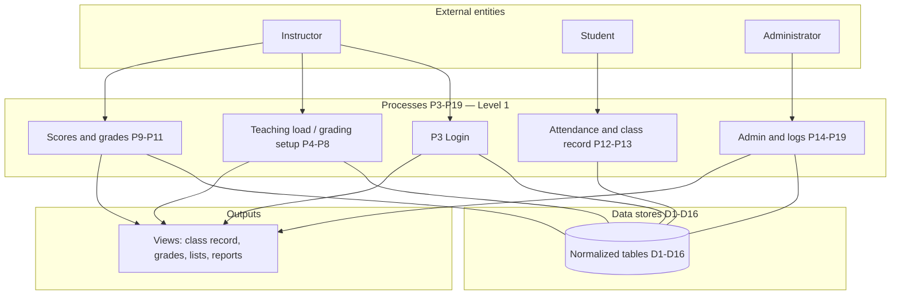

# DFD Level 1 — Educational Management & Grading System (Reference)

> **For the same diagram style applied to *this repo’s* Field Report stack**, see [`DFD_LEVEL1_FIELD_REPORT_PROJECT.md`](DFD_LEVEL1_FIELD_REPORT_PROJECT.md) and the printable [`dfd-level1-field-report-poster.html`](dfd-level1-field-report-poster.html) (Chrome → Print → Save as PDF).

This document **reproduces the structure** of the printed **Level 1 Data Flow Diagram** used as the course reference: an educational management and grading system with **Instructor**, **Student**, and **Administrator** actors; processes **P3–P19**; data stores **D1–D16**; and the listed outputs on the right of the figure.

**Reference image (same diagram as your photo):**  
[`educational-dfd-level1-reference.png`](educational-dfd-level1-reference.png) (bundled in this folder)

The [`dfd-mobile-web`](../README.md) prototype app is a **smaller** stack (field reports + logs) but follows the **same DFD pattern**: external entity → input/validation → data store → retrieval/logic → output.

---

## 1. External entities (actors)

| Entity | Role in the diagram |
|--------|---------------------|
| **Instructor** | Enters credentials, grading weights, base grades, activities, and student scores. |
| **Student** | Scans ID for attendance; scans class QR for class record / enrollment context. |
| **Administrator** | Maintains users, teaching loads, subjects, courses, roles; monitors logs. |

---

## 2. Processes (P3–P19)

| ID | Process name |
|----|----------------|
| P3 | Login |
| P4 | Add Teaching Load |
| P5 | Add Teaching Load Details |
| P6 | Add Grading Composition |
| P7 | Add Base Grade |
| P8 | View Class Record |
| P9 | Add Activity |
| P10 | Record Score |
| P11 | Calculate Grade |
| P12 | Record Attendance |
| P13 | Enter Class Record |
| P14 | User Account Management |
| P15 | System Logs Monitoring |
| P16 | Teaching Load Management |
| P17 | Subjects Management |
| P18 | Course Management |
| P19 | Roles Management |

---

## 3. Data stores (D1–D16)

| ID | Data store |
|----|------------|
| D1 | Users |
| D2 | Roles |
| D3 | Teachers |
| D4 | Semester |
| D5 | Students |
| D6 | Subjects |
| D7 | Teaching Loads |
| D8 | Teaching Load Details |
| D9 | Grade Category |
| D10 | Grading Composition |
| D11 | Grade Base |
| D12 | Grading |
| D13 | Term |
| D14 | Grading Detail |
| D15 | Enrollments |
| D16 | Courses |

---

## 4. Representative inputs (from actors → processes)

| From | Data / trigger | To process |
|------|----------------|------------|
| Instructor | Enter credentials | P3 |
| Instructor | Category weight | P6 |
| Instructor | Base grade details | P7 |
| Instructor | Activity context | P9 |
| Instructor | Student score | P10 |
| Student | Scan student ID | P12 |
| Student | Scan class QR code | P13 |
| Administrator | Users account details | P14 |
| Administrator | Teaching load details | P16 |
| Administrator | Subjects details | P17 |
| Administrator | Courses details | P18 |
| Administrator | Role detail | P19 |

Processes **P4–P5**, **P8**, **P11**, **P15** connect to **D1–D16** as shown on your original diagram (bidirectional flows omitted here for brevity).

---

## 5. Outputs (display / reports)

| Output | Driven by (process) |
|--------|----------------------|
| View User Details | P3 |
| View Teaching Loads | P4 |
| View Teaching Load Details | P5 |
| View Class Record | P8 |
| View Recorded Score | P10 |
| View Student Grade per Term | P11 |
| View Student Grade per Semester | P11 |
| View Enrolled Subject | P13 |
| View Student List | P14 |
| View Teacher List | P14 |
| Report | P15 |
| View Teaching Load List | P16 |
| View Subjects List | P17 |
| View Course List | P18 |

---

## 6. High-level Level 1 flow (conceptual — matches diagram layout)

The printed diagram reads left-to-right roughly as:

```text
[ Instructor | Student | Administrator ]
        |           |            |
        +-----------+------------+-----------+
                    v
           [ Authentication & domain processes P3-P19 ]
                    |
                    v
              [ D1 ... D16 Data Stores ]
                    |
                    v
        [ Outputs: Views per Term/Sem/List/Reports ]
```

Processes **P11 (Calculate Grade)** embody the main **calculation** logic; admin processes **P14–P19** maintain reference and master data in **D1–D16**; instructor and student processes read/write transactional data (scores, attendance, enrollment).

---

## 7. Mermaid overview (for slides or Markdown viewers)



---

## Alignment with `dfd-mobile-web` prototype

| Reference DFD concept | Implemented in prototype |
|----------------------|---------------------------|
| External entity | Mobile browser actor |
| Process 1 — input/validation | Express + `express-validator` on `/api/data/records` |
| Data stores | MySQL tables `users`, `records`, `activity_logs` |
| Process 2 — retrieval / logic | Role filtering + dashboard aggregation (`outputController`) |
| Process 3 — output generation | JSON dashboard + PDF export |
| Outputs | Dashboard + Results + export |

For coursework, cite **this file plus the PNG** as the authoritative **Level 1** reference; cite the project README for how the running app maps to that pattern.
