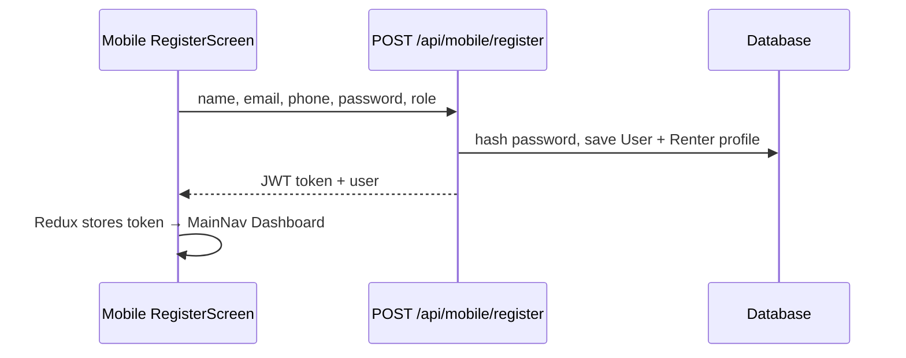

# Feature 1 — Email & password registration (step-by-step)

Real-estate terms: **renter** (stored as `ROLE_TENANT`), **property**, **lease booking** later in Feature 2.

## What you need running

1. `npm run casaclick:serve` (Symfony on port 8000)
2. Run migration (once):

   ```bash
   cd websitedev
   php bin/console doctrine:migrations:migrate
   ```

## Flow



## Files changed (Feature 1)

| Layer | File | What |
|-------|------|------|
| DB | `websitedev/migrations/Version20260520130000.php` | `user.phone`, activity log IP/platform |
| Backend | `websitedev/src/Entity/User.php` | `phone` field |
| Backend | `websitedev/src/Controller/Api/MobileApiController.php` | Register validates + returns **JWT** |
| Mobile | `src/app/api/mobile.ts` | `registerMobileUser` returns `{ token, user }` |
| Mobile | `src/app/authSlice.ts` | `registerWithEmail` thunk |
| Mobile | `src/screens/auth/RegisterScreen.tsx` | Full form + auto login |
| Mobile | `src/utils/registerValidation.ts` | Email/password/phone checks |
| Mobile | `src/components/AccountRolePicker.tsx` | Labels **Renter** / **Landlord** |

## Test

1. Open app → **Register**
2. Role: **Renter**
3. Fill name, email, phone, password, confirm password
4. Tap **Create renter account**
5. You should land on **Dashboard** (no extra login screen)

Demo after fixtures: use a **new** email, or delete the test user in DB.

## Next

Reply **“Feature 2”** when ready for the Customer Dashboard (bookings, saved properties, status colors).
